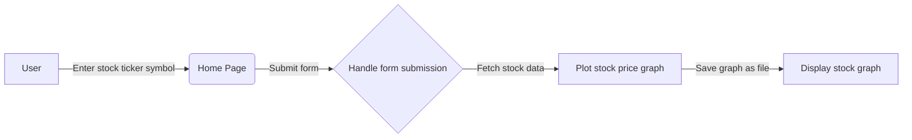

# Tech Solution:

To create an interactive website that allows users to enter a stock ticker symbol and view a stock price graph, we can use a combination of Python, Flask, and JavaScript.

Here are the step-by-step instructions for implementing the solution:

1. Set up a Flask web application:
   - Create a new directory for the project.
   - Install Flask using `pip install flask`.
   - Create a new Python file, e.g., `app.py`, and import the necessary modules:
     ```python
     from flask import Flask, render_template, request
     import yfinance as yf
     import matplotlib.pyplot as plt
     from datetime import datetime
     ```

2. Define the Flask routes:
   - Create a Flask application instance:
     ```python
     app = Flask(__name__)
     ```

   - Define a route for the home page where users can enter a stock ticker symbol:
     ```python
     @app.route('/', methods=['GET'])
     def index():
         return render_template('index.html')
     ```

   - Define a route for handling the form submission and displaying the stock price graph:
     ```python
     @app.route('/stock', methods=['POST'])
     def stock():
         ticker = request.form['ticker']
         start_date = datetime(datetime.now().year, 1, 1)
         end_date = datetime.now()
         data = yf.download(ticker, start=start_date, end=end_date)
         data['Return'] = (1 + data['Close'].pct_change()).cumprod()
         plt.figure(figsize=(14, 7))
         plt.plot(data['Return'], 'r', label=ticker)
         plt.title('Stock Price Change YTD')
         plt.xlabel('Date')
         plt.ylabel('Cumulative Return')
         plt.legend()
         plt.grid(True)
         plt.savefig('static/stock_graph.png')  # Save the graph as a static file
         return render_template('stock.html')
     ```

3. Create HTML templates:
   - Create a new directory called `templates`.
   - Create two HTML templates: `index.html` and `stock.html`.
   - In `index.html`, create a form for users to enter a stock ticker symbol:
     ```html
     <form action="/stock" method="post">
         <input type="text" name="ticker" placeholder="Enter a stock ticker symbol" required>
         <button type="submit">Submit</button>
     </form>
     ```

   - In `stock.html`, display the stock price graph:
     ```html
     
     ```

4. Create a static directory:
   - Create a new directory called `static`.
   - Place the existing `stock_data_plot_yfinance.py` file in the `static` directory.

5. Modify the existing code to save the stock price graph as a file:
   - Open the `stock_data_plot_yfinance.py` file.
   - Add the following line before `plt.show()` to save the graph as a file:
     ```python
     plt.savefig('static/stock_graph.png')
     ```

6. Run the Flask application:
   - In the terminal, navigate to the project directory.
   - Run the Flask application using `python app.py`.
   - Open a web browser and visit `http://localhost:5000` to access the interactive website.

The workflow of the tech solution can be represented using a Mermaid diagram:



Note: Make sure to install the necessary dependencies (`flask`, `yfinance`, `matplotlib`) using `pip` before running the application.

